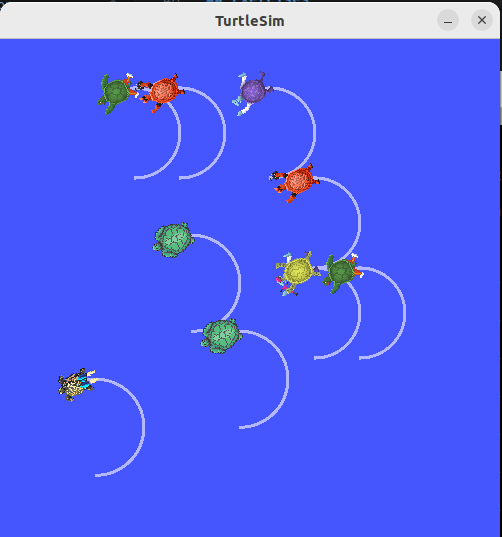
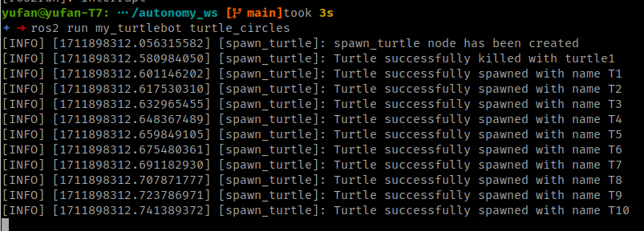
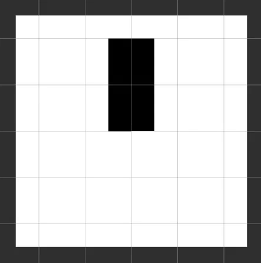
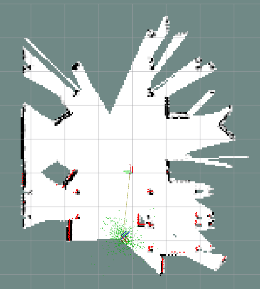
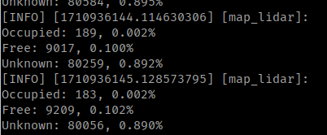
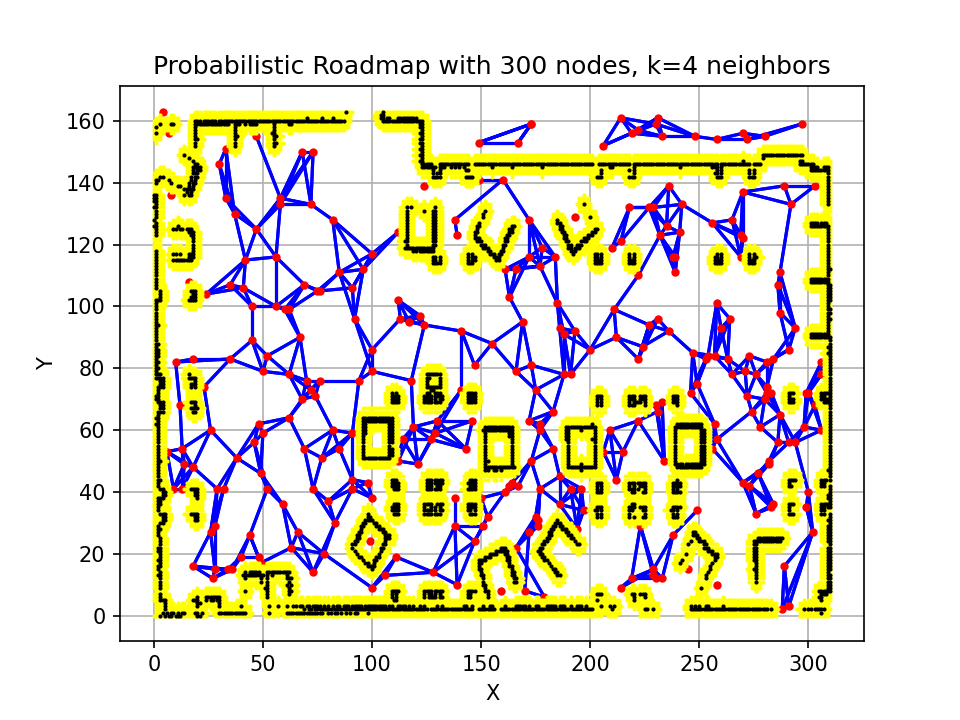
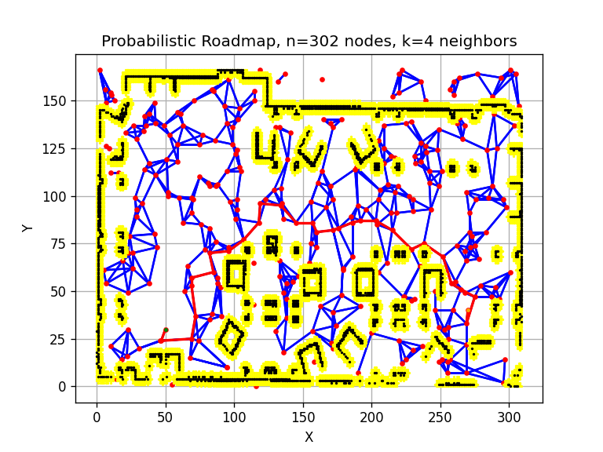

# 34761 Robot Autonomy

Notes and commands taken from lectures and exercises.

**Table of Contents**

<!-- toc -->

- [Set up VNC Container](#set-up-vnc-container)
- [Exercises](#exercises)
  - [Week 2 Exercise](#week-2-exercise)
  - [Week 3 Exercise](#week-3-exercise)
  - [Week 4 Exercise](#week-4-exercise)
  - [Week 5 Exercise](#week-5-exercise)
  - [Week 6 Exercise](#week-6-exercise)
  - [Week 7 Exercise](#week-7-exercise)
  - [Week 8 Exercise](#week-8-exercise)
- [ROS2 Concepts](#ros2-concepts)
  - [ros nodes](#ros-nodes)
  - [ros topics](#ros-topics)
  - [ros services](#ros-services)
  - [ros actions](#ros-actions)
  - [ros parameters](#ros-parameters)
  - [rqt_console](#rqt_console)
  - [ros packages](#ros-packages)
  - [ros workspace](#ros-workspace)

<!-- tocstop -->

**Exercise Log**

- Week 2
  - [x] ROS tutorial with turtlesim actions & services
- Week 3
  - [x] Spawn 10 turtles moving in circles
  - [x] Subscribe to LIDAR in turtlebot
  - [x] Make turtle2 follow turtle1 using tf2 broadcaster
- Week 4
  - [x] ICP with stationary robot
  - [ ] KISS ICP with constant velocity model
- Week 5
  - [x] Publish a map with random rectangle obstacles
  - [x] Create 2D map from LIDAR on a stationary robot
  - [x] Create 2D map from LIDAR on a moving robot
- Week 6
  - [ ] Implement your own particle filter
- Week 7
  - [x] Create map using SLAM
- Week 8
  - [x] Implement Dijkstra in Notebook
  - [x] Implement Probabilistic Roadmap (PRM) in ROS
  - [x] Query the PRM with to get path from start to end

## Set up VNC Container

```bash
cd docker-ros2-desktop-vnc/humble
docker build -t tiryoh/ros2-desktop-vnc:humble .
docker run -p 6080:80 --security-opt seccomp=unconfined --shm-size=512m tiryoh/ros2-desktop-vnc:humble
```

Go to `localhost:6080`, password: `ubuntu`

## Exercises

If there are errors encountered during `colcon build`, I think it requires the following package versions.

```bash
pip install setuptools_scm == 6.0
pip install setuptools == 58.2
```

For exercises with turtlebot, run these commands to set up the simulation environment.

```bash
cd autonomy_ws
source install/setup.bash
export ROS_DOMAIN_ID=11
export TURTLEBOT3_MODEL=burger
export GAZEBO_MODEL_PATH=$GAZEBO_MODEL_PATH:`ros2 pkg prefix my_turtlebot`/share/my_turtlebot/models
export GAZEBO_MODEL_PATH=$GAZEBO_MODEL_PATH:$(ros2 pkg prefix turtlebot3_gazebo)/share/turtlebot3_gazebo/models
```

Run teleoperation node for turtlebot.

```bash
ros2 run turtlebot3_teleop teleop_keyboard
```

### Week 2 Exercise

```bash
ros2 run turtlesim turtlesim_node

ros2 service call /kill turtlesim/srv/Kill "{name: turtle1}"
ros2 service call /spawn turtlesim/srv/Spawn "{x: 6, y: 3, theta: 0., name: 'T63'}"
ros2 run turtlesim turtle_teleop_key --ros-args --remap turtle1/cmd_vel:=T63/cmd_vel
ros2 bag -o bag1 record /T63/cmd_vel
ros2 bag play bag1
ros2 action send_goal /T63/rotate_absolute turtlesim/action/RotateAbsolute "{theta: 0.5}"
```

### Week 3 Exercise

**Task 1:** ROS node to spawn 10 turtles and move them in circles. (see `turtle_circles.py`)

```bash
ros2 run turtlesim turtlesim_node
ros2 run my_turtlebot turtle_circles
```





**Task 2:** Launch burger turtlebot simulation, use RVIZ, obtain LIDAR scan. (see `lidar_sub.py`)

```bash
sudo apt install ros-$ROS_DISTRO-nav2-bringup ros-$ROS_DISTRO-navigation2 ros-$ROS_DISTRO-turtlebot3-gazebo ros-$ROS_DISTRO-turtlebot3*

cd autonomy_ws
source install/setup.bash
export ROS_DOMAIN_ID=11
export TURTLEBOT3_MODEL=burger
export GAZEBO_MODEL_PATH=$GAZEBO_MODEL_PATH:`ros2 pkg prefix my_turtlebot`/share/my_turtlebot/models
export GAZEBO_MODEL_PATH=$GAZEBO_MODEL_PATH:$(ros2 pkg prefix turtlebot3_gazebo)/share/turtlebot3_gazebo/models

ros2 launch my_turtlebot turtlebot_simulation.launch.py
# In RViz, select '2D Pose Estimate', 
# click on the robot and drag  towards +x (red line)

ros2 run my_turtlebot lidar_sub
```

**Task 3:** TF2 broadcaster tutorial from [here](https://ros2-industrial-workshop.readthedocs.io/en/latest/_source/navigation/ROS2-TF2.html) (see scripts inside `tf_broadcaster` package)

```bash
sudo apt-get install ros-humble-rviz2 ros-humble-turtle-tf2-py ros-humble-tf2-ros ros-humble-tf2-tools ros-humble-turtlesim

ros2 pkg create --build-type ament_python tf_broadcaster --dependencies tf2_ros rclpy
pip3 install scipy

# Set up simulation, spawn turtle1
ros2 run turtlesim turtlesim_node
ros2 run turtlesim turtle_teleop_key

# Broadtcast turtle1
ros2 run tf_broadcaster broadcaster turtle1  
ros2 run tf2_ros tf2_echo turtle1 world

# Spawn and broadcast turtle2
ros2 service call /spawn turtlesim/srv/Spawn "{x: 2, y: 2, theta: 0.2, name: "turtle2"}"
ros2 run tf_broadcaster broadcaster turtle2

# Make turtle2 follow turtle1
ros2 run tf_broadcaster listener turtle1 turtle2
```

### Week 4 Exercise

**Task 1:** Create a localization ROS node for your turtlebot (not complete)

- Use the LIDAR scanner
- Assume a constant velocity model
- Publish a TF with the result of your odometry
- Compare with the one provided by ROS

LIDAR Localization with ICP (see `lidar_icp.py`)

```bash
ros2 launch my_turtlebot turtlebot_simulation.launch.py
# In RViz, select '2D Pose Estimate and click towards +x (red line)'

ros2 run my_turtlebot lidar_icp
ros2 run my_turtlebot lidar_icp --ros-args --log-level debug

# To move turtlebot and run lidar_localization,
ros2 launch my_turtlebot turtlebot_localization.launch.py
```

### Week 5 Exercise

**Task 1:** Publishing a map (see `map_random.py`)

- Create a 2D occupancy grid using a 2D matrix
- Fill random cells in the matrix with the value 100 and the rest with 0
- Create an OccupancyGrid message and fill in the information (along with your map)
- Publish the map on the topic /map with a frequency of 0.5Hz
- Remember to add a transform that the map can live in (either static or dynamic) (what does this mean?)

```bash
# In one terminal,
ros2 launch my_turtlebot turtlebot_rviz.launch.py 

# In another terminal,
ros2 run my_turtlebot map_random 
```



**Task 2:** Overlaying laser scans (see `map_lidar_static.py`)

- Create an empty 2D map
- Subscribe to the LIDAR topic and convert the LIDAR scan to Euclidean coordinates
- Add them to your internal map representation
- Publish the updated map

```bash
# In one terminal,
ros2 launch my_turtlebot turtlebot_simulation.launch.py
# In RViz, select '2D Pose Estimate', 
# click on the robot and drag  towards +x (red line)

# In another terminal,
ros2 run my_turtlebot map_lidar_static
```


**Task 3:** Moving the laser scan around in the map

- Use the odometry you developed last time to move the pointcloud as the robot moves

### Week 6 Exercise

**Task 1:** Using your own localization and accumulate a map when you drive around in the environment (see `map_lidar.py`)

- Use a counter to define if a cell is free or occupied

```bash
# In one terminal,
ros2 launch my_turtlebot turtlebot_simulation.launch.py rviz_config_file:=/home/yufan/autonomy_ws/src/RobotAutonomy/rviz/nav2_yufan_view.rviz
# In RViz, select '2D Pose Estimate', 
# click on the robot and drag  towards +x (red line)

# In another terminal,
ros2 run my_turtlebot map_lidar
```





**Task 2:** The simulation we are using already uses a particle filter to perform localization [not done]

- Set an initial starting point of the robot in rviz using the “2D pose estimate” button
- Create a ROS2 node that
  - Prints the number of particles used
  - Computes the expected position of the robot based on the particles
- Change the number of particles when you launch the simulation

```bash
# In one terminal,
ros2 launch my_turtlebot turtlebot_simulation.launch.py
# In RViz, select '2D Pose Estimate', 
# click on the robot and drag  towards +x (red line)

# In another terminal,
ros2 run my_turtlebot particle_sub 
```

**Task 3:** Implement your own particle filter for localization in a map

- Use the cmd_topic to estimate your motion model
- Subscribe to the LIDAR topic and compute features
- For each particle compute the error for each feature
- Update your importance weights based on the error

### Week 7 Exercise

**Task 1**: Create your own map in the simulation using SLAM

- This task follows [this tutorial](https://ros2-industrial-workshop.readthedocs.io/en/latest/_source/navigation/ROS2-Cartographer.html)
- Launch simulation with SLAM

```bash
ros2 launch my_turtlebot turtlebot_simulation.launch.py slam:=True

ros2 run turtlebot3_teleop teleop_keyboard
```

- Make sure that the fixed frame in RVIz is set to `map`.
- Move the robot through the environment using teleoperation or RViz Nav2Goal.
- Save the map.

```bash
ros2 run nav2_map_server map_saver_cli -f map
ros2 run nav2_map_server map_saver_cli -f sparse_map
```

- Launch simulation without SLAM.

```bash
ros2 launch my_turtlebot turtlebot_simulation.launch.py map:=/home/yufan/autonomy_ws/src/RobotAutonomy/maps/yf_map.yaml
```

- 2 files `map.pgm` and `map.yaml` will be generated. Put them in the map directory of the
my_turtlebot package and launch the simulation again without the slam argument

**Task 2**: Use the odometry topic provided by the simulation to accumulate a map (if you don’t already have
your own localization/odometry)

**Task 3**: Use a counter to define if a cell is free or occupied

**Task 4**: Continue on your own localization and map integration

- Using your own localization, accumulate a map when you drive around in the environment

### Week 8 Exercise

**Task 1**: Implement a probailistic roadmap method.

- In ROS2, subscribe to the map topic and use that map for collision checks.
- Assume constant cost value for all nodes.
- Use any nearest neighbor implementation.
- Create a function that takes as input a number of randomly samped node positions and returns the graph G.


```bash
ros2 launch my_turtlebot turtlebot_simulation.launch.py map:=/home/yufan/autonomy_ws/src/RobotAutonomy/maps/yf_map.yaml

ros2 run my_turtlebot planner_prm
```

> [!NOTE]
> `connect_k_nearest_neighbors()` <br>
> Find K-nearest neighbours, create edge if the path is collision-free. This results in each node having at most K edges created, but usually having less than K. <br>
> `create_k_nearest_edges()` <br>
> Add K shortest edges that are collision free. This ensures that more nodes have K edges created, but the edges will not be to the K-nearest neighbours



**Task 2**: Query the plan from the previous exercise.

- By searching for the list of vertices in the graph that connects the start and the goal.
- Create a function that takes as input a start, goal, and a graph, and returns a list of nodes on the queried path.



## ROS2 Concepts

### ros nodes

```bash
ros2 run <package_name> <executable_name>
ros2 node list
ros2 run turtlesim turtlesim_node --ros-args --remap __node:=my_turtle
ros2 node info <node_name>
```

`remap`: reassign default node properties

### ros topics

- continuous data streams, published/subscribed at any time regardless of senders/receivers
- many to many connections

```bash
rqt_graph             # visualize nodes & topics
ros2 topic list
ros2 topic list -t    # append topic type
ros2 topic echo <topic_name>
ros2 topic info <topic_name> --verbose  # shows QOS profile
ros2 topic info <topic_name>
ros2 topic hz <topic_name>     # pub rate
ros2 interface show <msg_name>

ros2 topic pub <topic_name> <msg_type> '<args>'
ros2 topic pub --rate 1 /turtle1/cmd_vel geometry_msgs/msg/Twist "{linear: {x: 2.0, y: 0.0, z: 0.0}, angular: {x: 0.0, y: 0.0, z: 1.8}}"
```

### ros services

- call-and-response model. cannot be cancelled preemptively.
- useful for trigger behaviour
- client sends a request message to the service server, receives a response message from server
- msg structure: request, response
- many service client to 1 service server

```bash
ros2 service list
ros2 service type <service_name>
ros2 service find <type_name>
ros2 interface show <type_name>
ros2 service call <service_name> <service_type> <arguments>
ros2 service call /spawn turtlesim/srv/Spawn "{x: 2, y: 2, theta: 0.2, name: ''}"
```

### ros actions

- for long running tasks, discrete behaviour, can be cancelled. provides feedback during execution.
- msg structure: goal, result, intermediate result/feedback
- action server (accepts/rejects requests) , action client

```bash
ros2 action list
ros2 action info <action_name>
ros2 interface show <action_name>
ros2 action send_goal <action_name> <action_type> <values>
```

### ros parameters

- Parameter: configuration value of a node (bool, float, str, list)

```bash
ros2 param list
ros2 param get <node_name> <parameter_name>
ros2 param set <node_name> <parameter_name> <value>
ros2 param dump <node_name>
ros2 param dump /turtlesim > turtlesim.yaml
ros2 param load <node_name> <param_file>
ros2 run <package_name> <executable_name> --ros-args --params-file <file_name>
```

### rqt_console

GUI tool to introspect log messages, collect them over time in an organized manner

```bash
ros2 run rqt_console rqt_console
```

- `Fatal` messages indicate the system is going to terminate to try to protect itself from detriment.
- `Error` messages indicate significant issues that won’t necessarily damage the system, but are preventing it from functioning properly.
- `Warn` messages indicate unexpected activity or non-ideal results that might represent a deeper issue, but don’t harm functionality outright.
- `Info` messages indicate event and status updates that serve as a visual verification that the system is running as expected.
- `Debug` messages detail the entire step-by-step process of the system execution.

```bash
# launch & bag
ros2 launch <package> <launch_file>
ros2 bag record <topic_name>
# choose name of rosbag
ros2 bag record -o <bag_name> /turtle1/cmd_vel /turtle1/pose
ros2 bag play <bag_name>
```

### ros packages

- package: organization unit of ROS2 code, uses `ament` as build system, `colcon` as build tool, create package using Python or CMake
- add python executable to the build system by modifying `setup.py`

```bash
ros2 pkg create --build-type ament_python <pkg_name>
colcon build --packages-select <pkg_name> --symlink-install
source install/local_setup.bash
```

### ros workspace

- space to store entire project (source, build, resources)

  - `build`: temporary build files

  - `log`: store generated logs

  - `install`: final binaries/libraries are stored, modified by build system

  - `src`: modified by user, directory to place code

  - ```bash
    ros2_ws
    ├── build
    ├── install
    │   ├── setup.bash
    ├── log
    ├── src
    │   ├── my_package1 
    │   ├── my_package2
    ```

- `~/ros2_ws$ source install/setup.bash`

- `source /opt/ros/humble/setup.bash`
